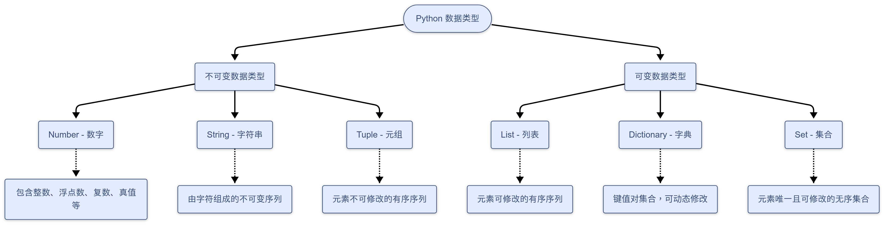
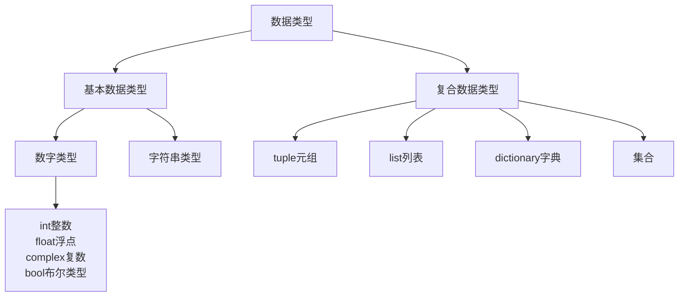
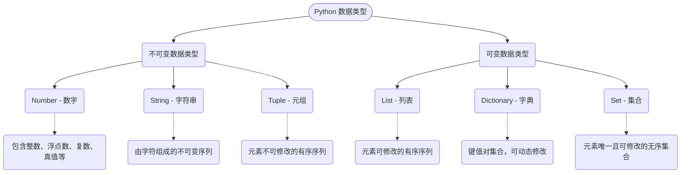

# 图解

python里面全部都是类！没有基本类型！

## 一、按照基本和复合数据类型划分

```mermaid
graph TB
all["数据类型"]
all-->basic
basic["基本数据类型"]
basic-->number
number["数字类型"]
num["int整数<br>float浮点<br>complex复数<br>bool布尔类型"]
number-->num
basic-->string
string["字符串类型"]

all-->complexDate
complexDate["复合数据类型"]
-->tuple["tuple元组"] & list["list列表"] & dictionary["dictionary字典"] & set["集合"]
```

## 二、按照是否可变划分

```mermaid
flowchart TB


    A([Python 数据类型]):::startend
    A --> B(不可变数据类型):::process
    A --> C(可变数据类型):::process

    B --> B1(Number - 数字):::process
    B --> B2(String - 字符串):::process
    B --> B3(Tuple - 元组):::process

    B1 -.-> B11(包含整数、浮点数、复数、真值等):::decision
    B2 -.-> B21(由字符组成的不可变序列):::decision
    B3 -.-> B31(元素不可修改的有序序列):::decision

    C --> C1(List - 列表):::process
    C --> C2(Dictionary - 字典):::process
    C --> C3(Set - 集合):::process

    C1 -.-> C11(元素可修改的有序序列):::decision
    C2 -.-> C21(键值对集合，可动态修改):::decision
    C3 -.-> C31(元素唯一且可修改的无序集合):::decision
```