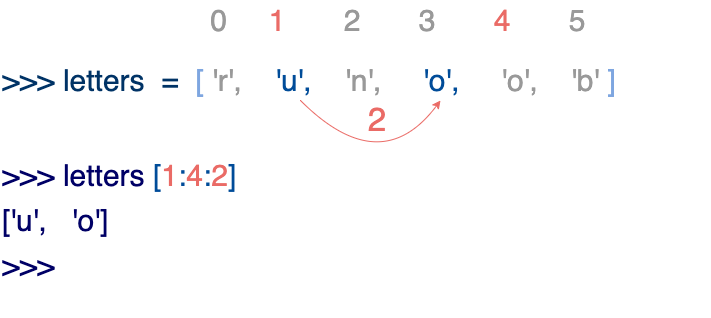

# 一、定义
List（列表） 是 Python 中使用最频繁的数据类型。

列表中元素的类型`可以不相同`，它支持`数字`，`字符串`甚至可以包含`列表`（所谓嵌套）。

列表是写在`方括号 []` 之间、用`逗号分隔开`的元素列表。

```python
#!/usr/bin/python3

list = [ 'abcd', 786 , 2.23, 'runoob', 70.2 ]  # 定义一个列表
tinylist = [123, 'runoob']

print (list)            # 打印整个列表
print (list[0])         # 打印列表的第一个元素
print (list[1:3])       # 打印列表第二到第四个元素（不包含第四个元素）
print (list[2:])        # 打印列表从第三个元素开始到末尾
print (tinylist * 2)    # 打印tinylist列表两次
print (list + tinylist)  # 打印两个列表拼接在一起的结果
```
---

# 二、基本操作
## 1.类字符串操作
和字符串一样，列表同样可以被索引和截取，列表被截取后返回一个包含所需元素的新列表。

列表截取的语法格式如下：

变量[头下标:尾下标]

索引值以 `0 为开始值`，`-1` 为从末尾的开始位置。

## 2.含步长操作



Python 列表截取可以接收第三个参数，参数作用是`截取的步长`
```python

```