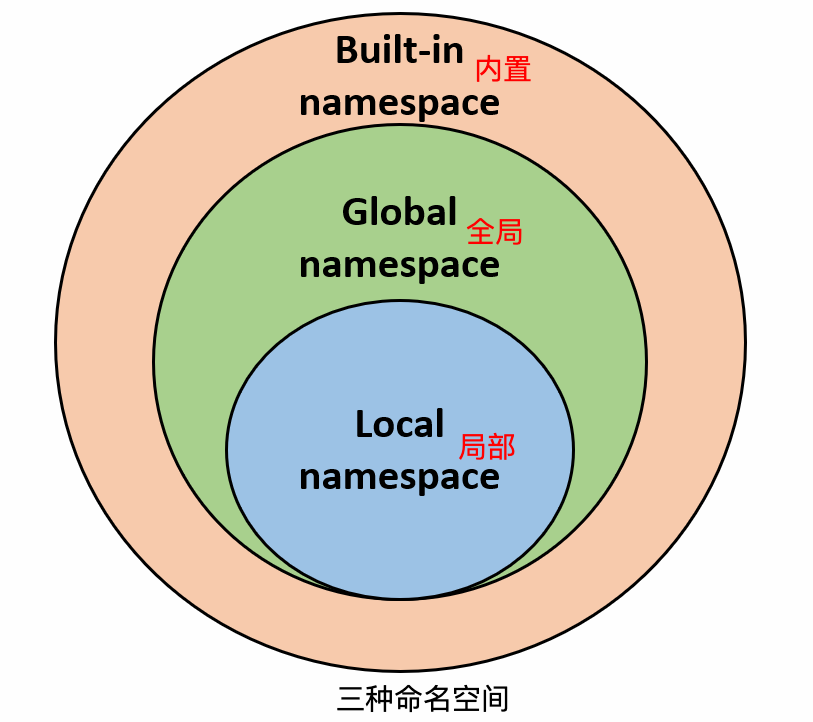

# 一、命名空间
## 1.定义：
命名空间是一个系统为`变量唯一命名的范围`，在这个范围里，`名字会有一套独特的规则`。

---
## 2.命名空间的分类

### 2.1.内置名称（built-in names）
Python 语言`内置的名称`，比如`函数名` abs、char 和异常名称 BaseException、Exception 等等。

### 2.2.全局名称（global names）
`模块`中定义的名称，记录了`模块的变量`，包括`函数`、`类`、`其它导入的模块`、`模块级的变量和常量`。

### 2.3.局部名称（local names）
`函数中定义的名称`，记录了函数的变量，包括`函数的参数和局部定义的变量`。（`类中定义的也是`）

---
## 3.命名空间查找顺序

`局部`的命名空间 -> `全局`命名空间 -> `内置`命名空间。



# 二、命名空间的生命周期
命名空间的生命周期`取决于对象的作用域`，如果`对象执行完成`，则该`命名空间`的`生命周期就结束`。

例如
```python
# var1 是全局名称
var1 = 5
def some_func(): 
  
    # var2 是局部名称
    var2 = 6
    def some_inner_func(): 
  
        # var3 是内嵌的局部名称
        var3 = 7
```