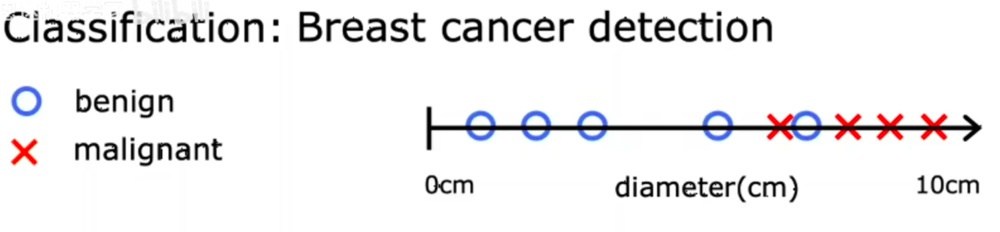
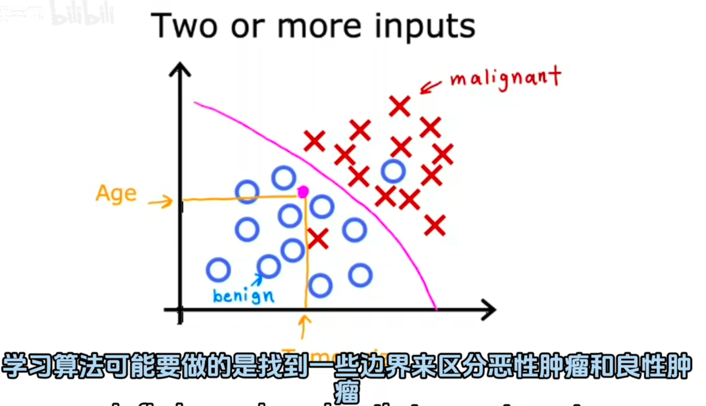

# 分类(Classification)：
分类任务的目标是将输入数据`划分到预定义的离散类别`中。在这种任务里，输入变量可以是连续的或离散的，但`输出变量是离散的类别标签`。
例如，判断一封`电子邮件是否为垃圾邮件`（类别为“垃圾邮件”或“非垃圾邮件”），或者识别一张图像中的动物是`猫、狗还是鸟`等。

例如一下癌症预测函数：
这是只有一个输入变量的分类函数：

但是也可以有多个输入变量：

