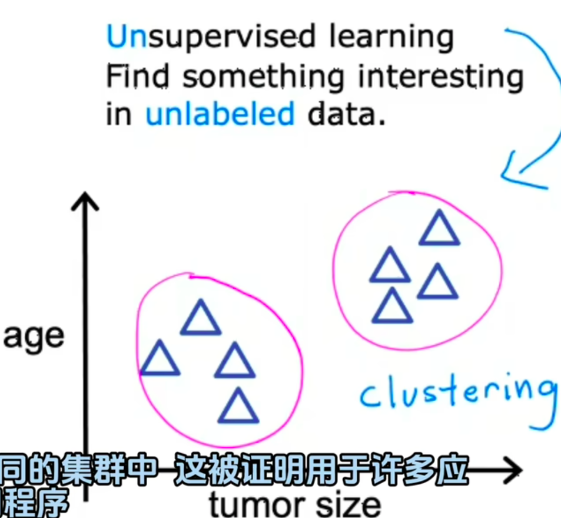
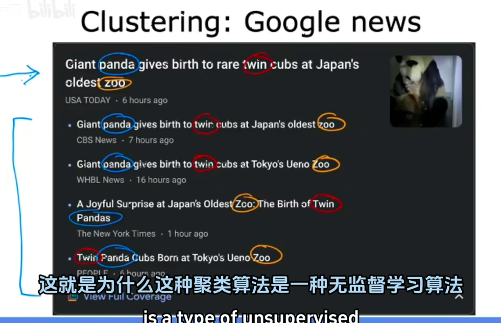
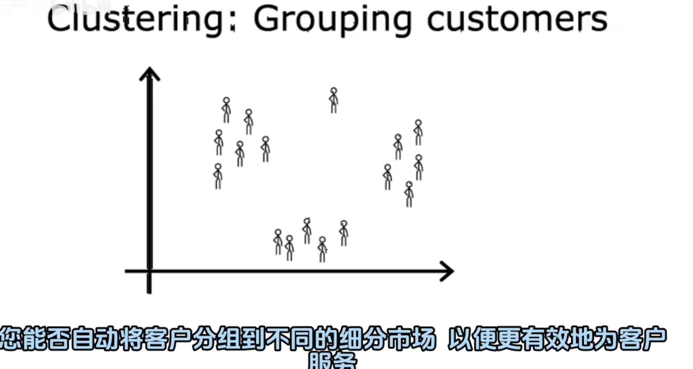

## 聚类(Clustering)：
聚类任务的目标是将数据`分成不同的组或簇`，使得`同一组内的数据相似度较高`，而不同组之间的数据`相似度较低`。聚类算法通常用于发现数据中的`隐藏结构`，如`客户细分`、`图像分割`等。
 
 比如下面的癌细胞预测，就是自己分组！
 

再比如下面的新闻分类，也是自己分组，因为没人能预测到每天的新闻是什么！
 

再如下面的客户信息分类，提取出客户的特征，然后自己分组！

